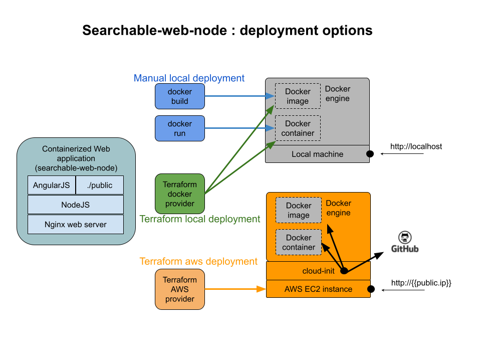

# serachable-web-node

## Introduction
serachable-web-node is a web application which provides a simple search for files in a public folder. the project focuses on the deployment rather than the app itself.

### Project target
define various deployment options using tools like
* Docker build
* Docker run
* Terraform
* Cloud-init

### Deployment options


### Web Application
The web application provides dynamic search for local files. it uses [AngularJS](https://angularjs.org/) on the client-side and nodejs on the server-side.
the client has a searchbox to search for local html docs inside the public folder, on each typed letter, the search engine will filter results dynamically and locally to provide best performance

### Deployment 
* Option 1: Manual local deployment
  * This option will use a script that
    * Build a local docker image
    * Start a local docker container
```
./build-and-start.sh
```

* Option 2: Terraform local deployment
  * This option will use Terraform with docker provider. The result is 2 resources:
    * docker_image
    * docker_container
```
$ cd terraform-docker
$ terraform init
$ terraform validate  # optional
$ terraform plan      # optional
$ terraform apply
```

* Option3: Terraform aws deployment
  * This option will use Terraform to start a new ec2 instance and cloud-init to configure it:
    * Create users/groups on the new ec2 instance
    * Inject ssh public key, so we can connect with our private key (without aws keypair)
    * Install docker
    * Clone the project from github
    * Build the image
    * Start a container

First create ssh keys:
```
$ ssh-keygen -t rsa -C "your_email@example.com" -f ./tf-cloud-init
```
Then will have to modify the cloud-init.yml file with the content of your newly generated public key (./tf-cloud-init.pub) and:
```
$ cd terraform-docker
$ terraform init
$ terraform validate  # optional
$ terraform plan      # optional
$ terraform apply 
```

after launching the container, browse to http://localhost, then type 'a' in the searchbox to see local files in ./public folder

